<h2>TensorFlow-FlexUNet-Image-Segmentation-Full-Head-T1W (2026/02/15)</h2>
Sarah T.  Arai 
Software Laboratory antillia.com  
This is the first experiment of Image Segmentation for <b>Full-Head-T1W</b> based on our <a href="./src/TensorFlowFlexUNet.py">TensorFlowFlexUNet</a> 
(TensorFlow Flexible UNet Image Segmentation Model for Multiclass), 
and a 512x512 pixels PNG  <a href="https://drive.google.com/file/d/1AtIdyCBGYKsDQKWvFv-GXFhCRH7jLWXJ/view?usp=sharing">
 Full-Head-T1W-ImageMask-Dataset
 </a>, which was derived from <a href="https://www.kaggle.com/datasets/andrewbirnbaum/full-head-mri-and-segmentation-of-stroke-patients/data">
<b>Full-Head MRI & Segmentation of Stroke Patients</b></a> on the kaggle.com

    

<b>Actual Image Segmentation for Full-Head-T1W Images  of 512x512 pixels</b> 
As shown below, the inferred masks predicted by our segmentation model trained by the dataset appear similar to the ground truth masks.
 
<a href="#color-class-mapping-table">Color class mapping table</a>
  
<table>
<tr>
<th>Input: image</th>
<th>Mask (ground_truth)</th>
<th>Prediction: inferred_mask</th>
</tr>
<tr>
<td>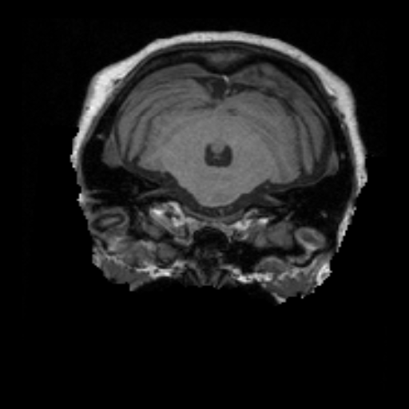</td>
<td>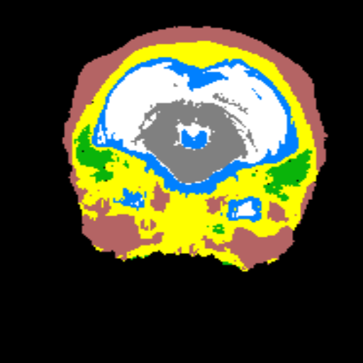</td>
<td>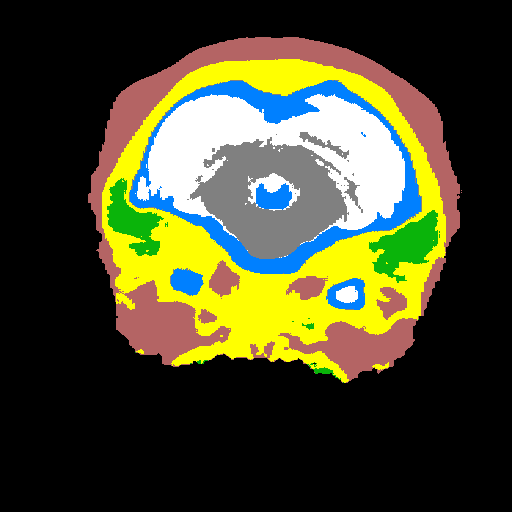</td>
</tr>

<tr>
<td>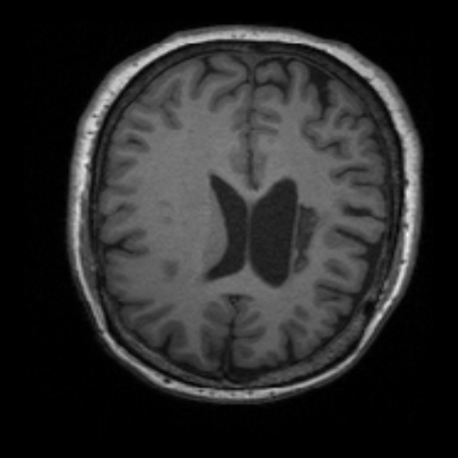</td>
<td></td>
<td>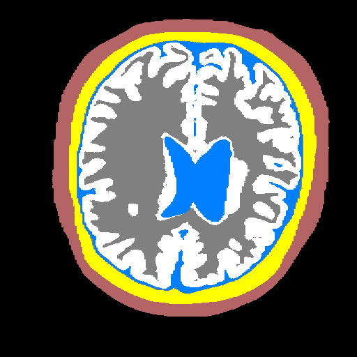</td>
</tr>

<tr>
<td>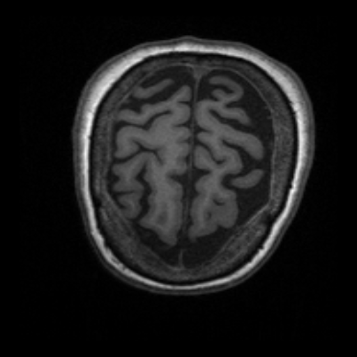</td>
<td></td>
<td></td>
</tr>
</table>

 
<h3>1  Dataset Citation</h3>
The dataset used here was derived from   
 <a href="https://www.kaggle.com/datasets/andrewbirnbaum/full-head-mri-and-segmentation-of-stroke-patients/data">
<b>Full-Head MRI & Segmentation of Stroke Patients </b></a> 
on the kaggle.com
  
The following explanation was taken from the above kaggle web site.
  
<b>About Dataset</b> 
<b>Citation</b> 
If you use this dataset in any work, please reference our paper: <a href="https://arxiv.org/pdf/2501.18716">
Full-Head Segmentation of MRI with Abnormal Brain Anatomy: Model and Data Release
</a>.
  

<b>A. Head MRI from Patients with Chronic Abnormalities and Healthy Subjects</b> 
The dataset consists of T1-weighted MRI scans from 54 individuals, collected across three different institutions, representing 
patients with varying clinical conditions. The data includes:
 
<ul>
<li>Healthy Subjects: 
 4 scans (Gender: 4M/0F, Ethnicity: 1 Asian, 3 White [non-Latino], Age: 30-50), obtained on a 3T Siemens Trio scanner (Erlangen, Germany).</li>
<li>Chronic Aphasia Stroke Patients: </li>
Georgetown University: 18 males, 10 females (Ethnicity: 1 Asian, 8 Black, 17 White [non-Latino], 1 White/Latino, 1 Unknown; Age: 41-75), imaged on a Siemens Trio 3T scanner.
 
University of North Carolina, Chapel Hill: 16 males, 5 females, 1 unknown gender (Ethnicity: 8 Black, 14 White [non-Latino]; Age: 44-75), imaged on a 3T Siemens Biograph mMR scanner.
 
 
<li>Chronic Apraxia Stroke Patients: 
New York University, New York: 8 males, 2 females (Ethnicity: 1 Asian, 1 Black, 7 White [non-Latino], 1 White/Latino; Age: 38-85), imaged on a 3T Siemens Prisma scanner.
</li>
</ul>
Patients had their lesions or injuries occur at least 6 months prior to the MRI scan, at which point the affected brain areas were largely replaced by cerebrospinal fluid (CSF). All scans have an isotropic resolution of 1mm. Data was collected with IRB approval, and the public release will be de-identified (Version 2).
  
<b>B. Creation of Segmentation Labels</b> 
For all available MRIs, volumetric segmentations were generated, labeling each voxel into one of seven possible categories: 
<ul>
<li>Background (extracranial air)</li>
<li>Air cavities</li>
<li>White matter (WM)</li>
<li>Gray matter (GM)</li>
<li>Cerebrospinal fluid (CSF)</li>
<li>ABone</li>
<li>Non-brain soft tissue</li>
</ul>
 
<b>License</b> 
<a href="https://creativecommons.org/licenses/by-nc-sa/4.0/">CC BY-NC-SA 4.0</a>
 
 
<h3>
2 Full-Head-T1W ImageMask Dataset
</h3>
 If you would like to train this Full-Head-T1W Segmentation model by yourself,
please down load  the <a href="https://drive.google.com/file/d/1AtIdyCBGYKsDQKWvFv-GXFhCRH7jLWXJ/view?usp=sharing">
Full-Head-T1W-ImageMask-Dataset.zip
 </a> on the google driive.
</b>  
<pre>
./dataset
└─Full-Head-T1W
    ├─test
    │   ├─images
    │   └─masks
    ├─train
    │   ├─images
    │   └─masks
    └─valid
        ├─images
        └─masks
</pre>
 
We used a Python script <a href="./generator/ImageMaskDatasetGenerator.py">ImageMaskDatasetGenerator.py</a> to generate 
<b> Full-Head-T1W-ImageMask-Dataset</b>  from the original dataset, and  the following color-class mapping table  between indexed colors and rgb colors  
to generate colorized masks 
 
<a id="color-class-mapping-table"><b>Full-Head-T1W color class mapping table</b></a><table border=1 style='border-collapse:collapse;' cellpadding='5'>
<table border=1 style='border-collapse:collapse;' cellpadding='5'>
<tr><th>Indexed Color</th><th>Color</th><th>RGB</th><th>Class</th></tr>
<tr><td>1</td><td with='80' height='auto'></td><td>(10, 180, 10)</td><td>cavities</td></tr>
<tr><td>2</td><td with='80' height='auto'></td><td>(255, 255, 255)</td><td>White matter</td></tr>
<tr><td>3</td><td with='80' height='auto'></td><td>(128, 128, 128)</td><td>Gray matter</td></tr>
<tr><td>4</td><td with='80' height='auto'></td><td>(0, 128, 255)</td><td>Cerebrospinal fluid</td></tr>
<tr><td>5</td><td with='80' height='auto'></td><td>(255, 255, 0)</td><td>Bone</td></tr>
<tr><td>6</td><td with='80' height='auto'></td><td>(180, 100, 100)</td><td>Non-brain soft tissue skin</td></tr>
</table>
 
<b>Full-Head-T1W Statistics</b> 
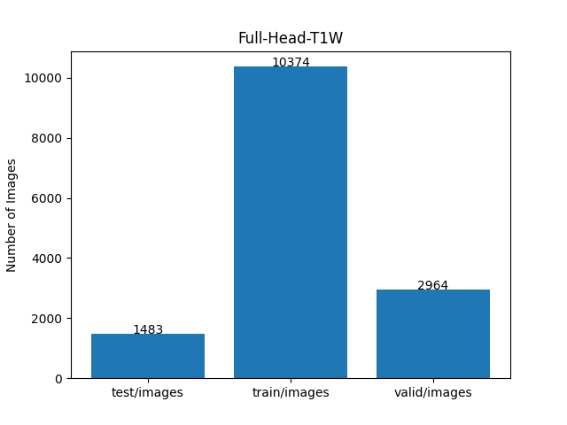 
 
As shown above, the number of images of train and valid datasets is large enough to use for a training set of our segmentation model.
  

<b>Train_images_sample</b> 
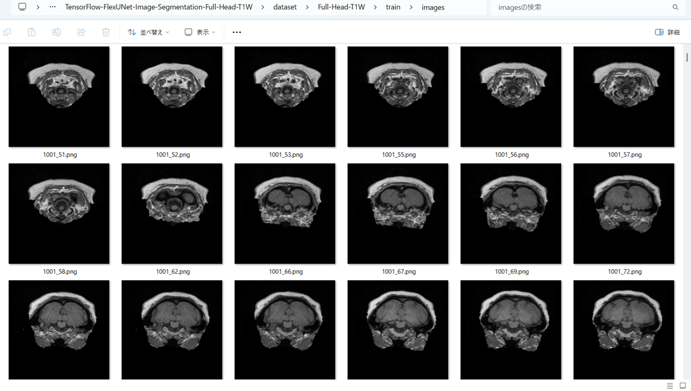
 
<b>Train_masks_sample</b> 
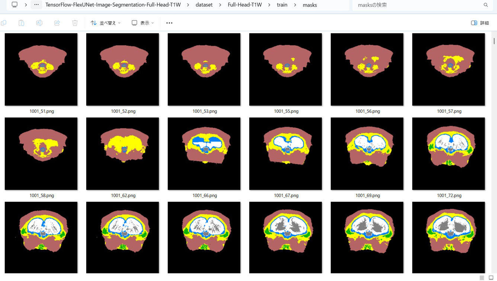
 
<h3>
3 Train TensorflowFlexUNet Model
</h3>
 We trained Full-Head-T1W TensorflowFlexUNet Model by using the following
<a href="./projects/TensorFlowFlexUNet/Full-Head-T1W/train_eval_infer.config"> <b>train_eval_infer.config</b></a> file.  
Please move to ./projects/TensorFlowFlexUNet/Full-Head-T1W and run the following bat file. 
<pre>
>1.train.bat
</pre>
, which simply runs the following command. 
<pre>
>python ../../../src/TensorFlowFlexUNetTrainer.py ./train_eval_infer.config
</pre>

<b>Model parameters</b> 
Defined a small <b>base_filters=16</b> and a large <b>base_kernels=(11,11)</b> for the first Conv Layer of Encoder Block of 
<a href="./src/TensorFlowFlexUNet.py">TensorFlowFlexUNet.py</a> 
and a large num_layers (including a bridge between Encoder and Decoder Blocks).
<pre>
[model]
image_width    = 512
image_height   = 512
image_channels = 3
input_normalize = True
normalization   = False
num_classes    = 7
base_filters   = 16
base_kernels  = (11,11)
num_layers    = 8
dropout_rate   = 0.05
dilation       = (1,1)
</pre>

<b>Learning rate</b> 
Defined a small learning rate.  
<pre>
[model]
learning_rate  = 0.00007
</pre>

<b>Loss and metrics functions</b> 
Specified "categorical_crossentropy" and "dice_coef_multiclass". 
<pre>
[model]
loss           = "categorical_crossentropy"
metrics        = ["dice_coef_multiclass"]
</pre>
<b >Learning rate reducer callback</b> 
Enabled learing_rate_reducer callback, and a small reducer_patience.
<pre> 
[train]
learning_rate_reducer = True
reducer_factor     = 0.5
reducer_patience   = 4
</pre>
<b>Early stopping callback</b> 
Enabled early stopping callback with patience parameter.
<pre>
[train]
patience      = 10
</pre>
<b></b> 
<b>RGB color map</b> 
rgb color map dict for Full-Head-T1W 1+1 classes. 
<pre>
[mask]
mask_file_format = ".png"
;Full-Head-T1W 1+6
rgb_map = {(0,0,0):0, (10,180,10):1, (255,255,255):2, (128,128,128):3, (0,128,255):4, (255,255,0):5, (180,100,100):6 }       
</pre>
<b>Epoch change inference callbacks</b> 
Enabled epoch_change_infer callback. 
<pre>
[train]
epoch_change_infer       = True
epoch_change_infer_dir   =  "./epoch_change_infer"
epoch_changeinfer        = False
epoch_changeinfer_dir    = "./epoch_changeinfer"
num_infer_images         = 6
</pre>
By using this epoch_change_infer callback, on every epoch_change, the inference procedure can be called
 for 6 images in <b>mini_test</b> folder. This will help you confirm how the predicted mask changes 
 at each epoch during your training process.    
<b>Epoch_change_inference output at starting (1,2,3)</b> 
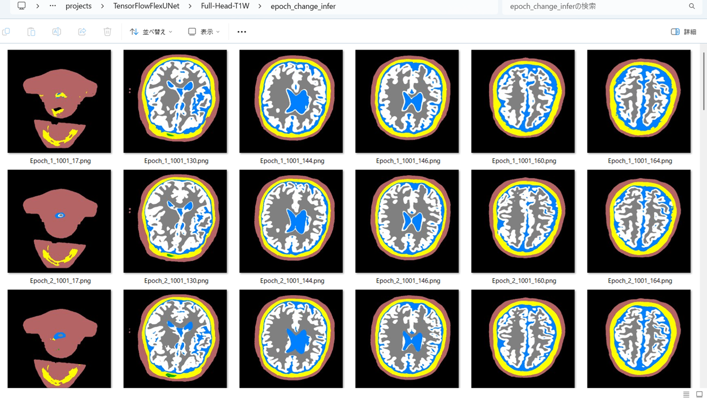 
 
<b>Epoch_change_inference output at middle-point (28,29,30)</b> 
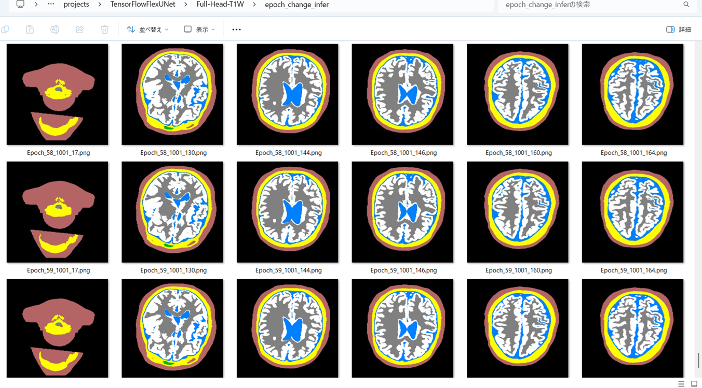 
 
<b>Epoch_change_inference output at ending (58,59,60)</b> 
 

 
In this experiment, the training process was terminated at epoch 60.  
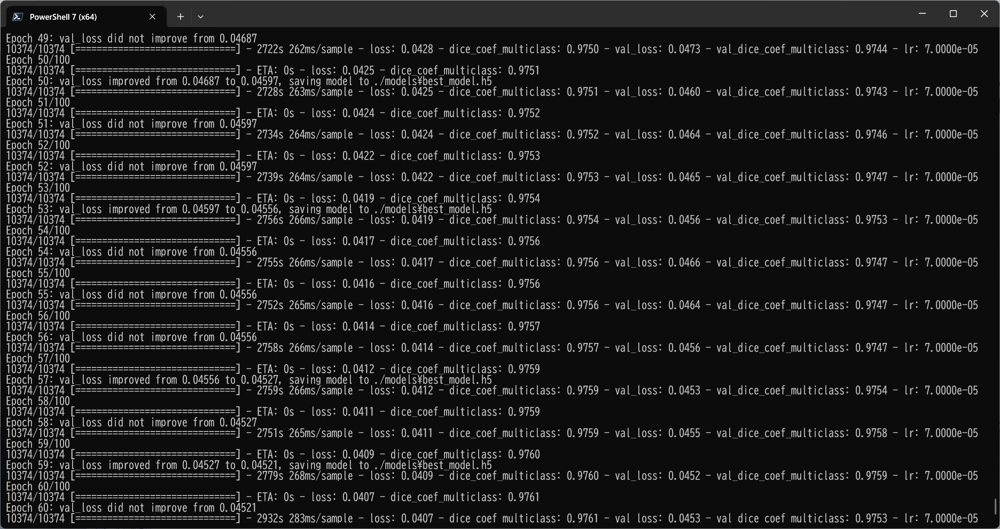 
 
<a href="./projects/TensorFlowFlexUNet/Full-Head-T1W/eval/train_metrics.csv">train_metrics.csv</a> 
 

 
<a href="./projects/TensorFlowFlexUNet/Full-Head-T1W/eval/train_losses.csv">train_losses.csv</a> 
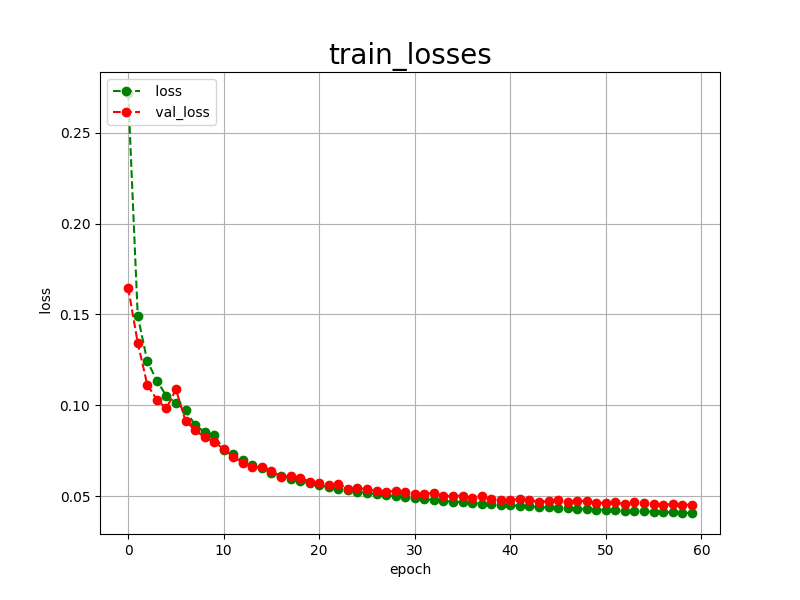 
 
<h3>
4 Evaluation
</h3>
Please move to a <b>./projects/TensorFlowFlexUNet/Full-Head-T1W</b> folder, 
and run the following bat file to evaluate TensorflowFlexUNet model for Full-Head-T1W. 
<pre>
>./2.evaluate.bat
</pre>
This bat file simply runs the following command.
<pre>
>python ../../../src/TensorFlowFlexUNetEvaluator.py  ./train_eval_infer.config
</pre>
Evaluation console output: 
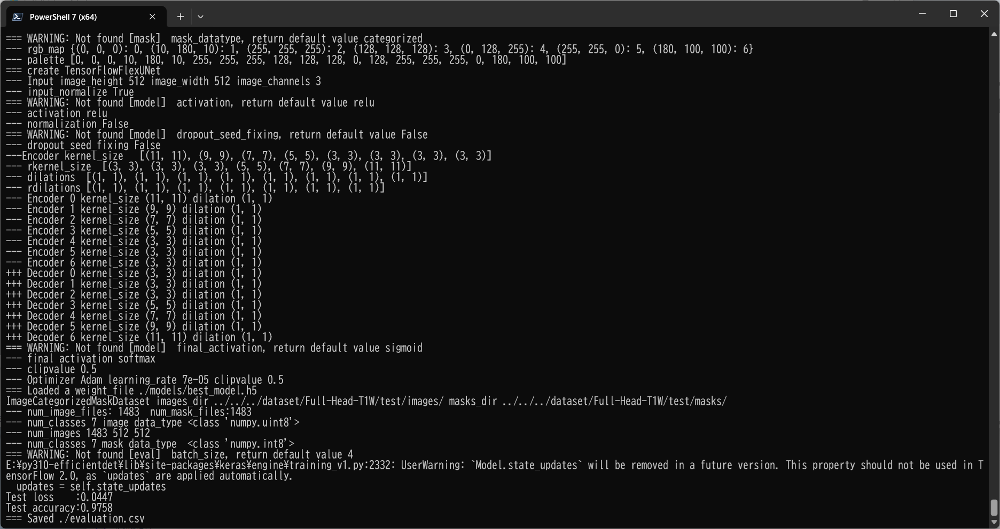
  Image-Segmentation-Full-Head-T1W

<a href="./projects/TensorFlowFlexUNet/Full-Head-T1W/evaluation.csv">evaluation.csv</a> 
The loss (categorical_crossentropy) to this Full-Head-T1W/test was not low, and dice_coef_multiclass not high as shown below.
 
<pre>
categorical_crossentropy,0.0447
dice_coef_multiclass,0.9758
</pre>
 
<h3>5 Inference</h3>
Please move to a <b>./projects/TensorFlowFlexUNet/Full-Head-T1W</b> folder 
,and run the following bat file to infer segmentation regions for images by the Trained-TensorflowFlexUNet model for Full-Head-T1W. 
<pre>
>./3.infer.bat
</pre>
This simply runs the following command.
<pre>
>python ../../../src/TensorFlowFlexUNetInferencer.py ./train_eval_infer.config
</pre>

<b>mini_test_images</b> 
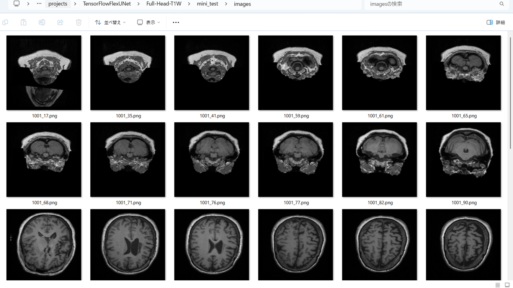 
<b>mini_test_mask(ground_truth)</b> 
 

<b>Inferred test masks</b> 
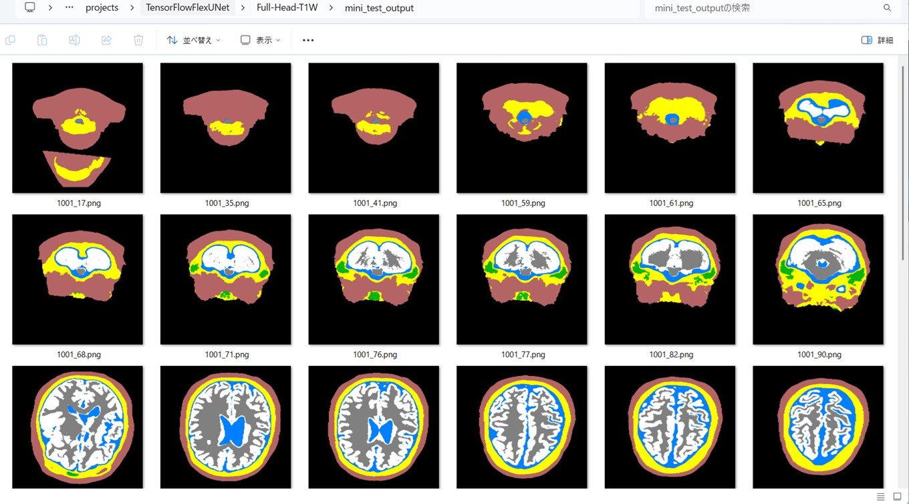 
 

<b>Enlarged images and masks for  Full-Head-T1W  Images </b> 
As shown below, the inferred masks predicted by our segmentation model trained by the dataset appear similar to the ground truth masks.
 
<a href="#color-class-mapping-table">Color class mapping table</a>
 
<table>
<tr>
<th>Input: image</th>
<th>Mask (ground_truth)</th>
<th>Prediction: inferred_mask</th>
</tr>
<tr>
<td>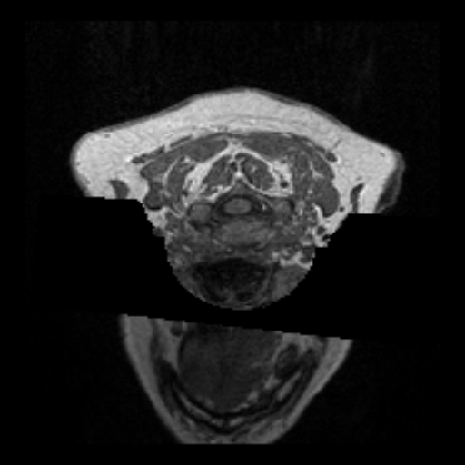</td>
<td></td>
<td></td>
</tr>

<tr>
<td>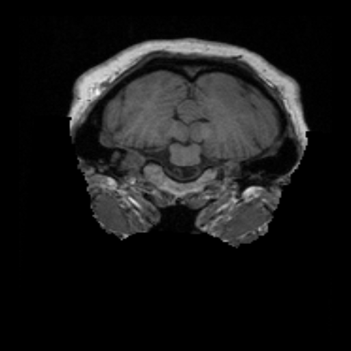</td>
<td>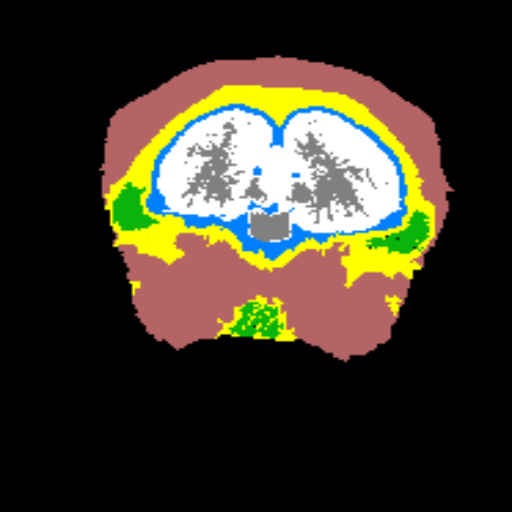</td>
<td>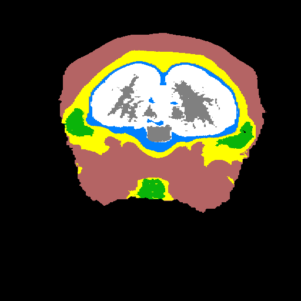</td>
</tr>

<tr>
<td>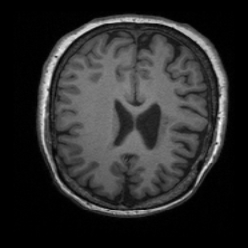</td>
<td>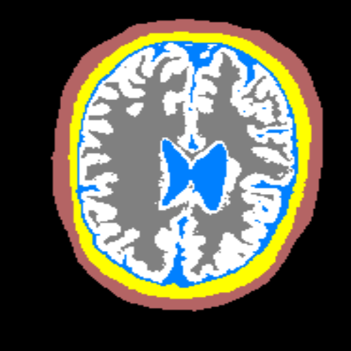</td>
<td>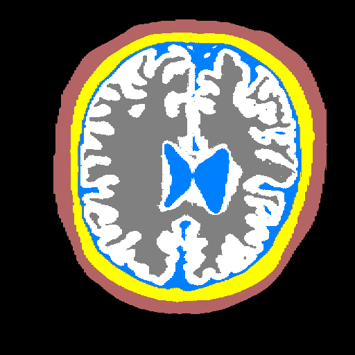</td>
</tr>
<tr>
<td>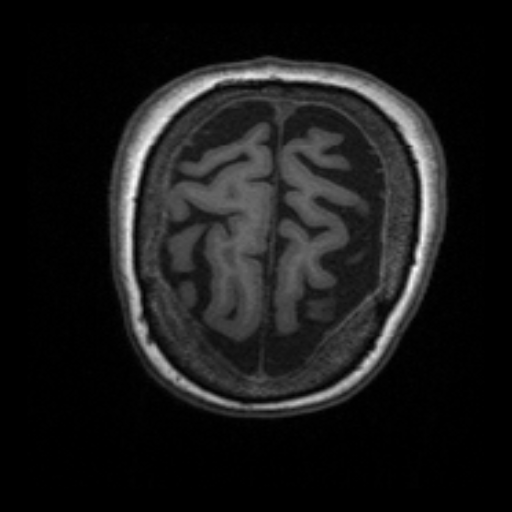</td>
<td></td>
<td>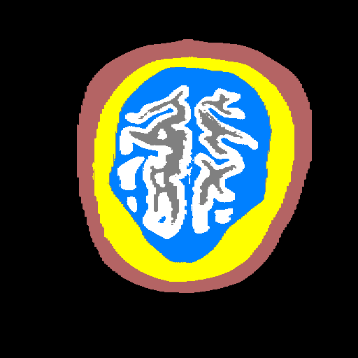</td>
</tr>
<tr>
<td>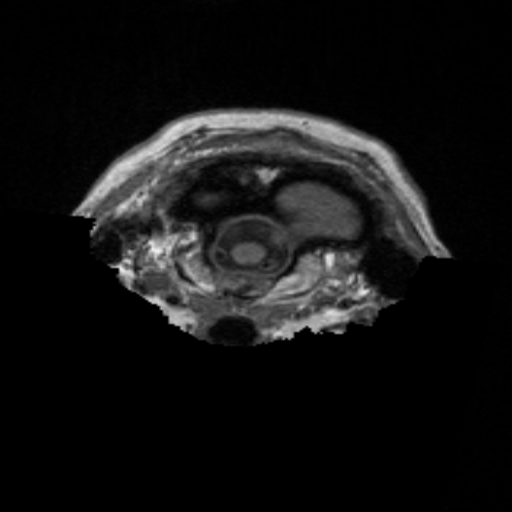</td>
<td>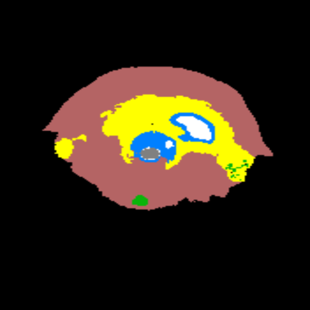</td>
<td>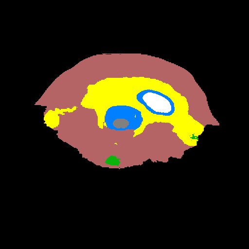</td>
</tr>
<tr>
<td>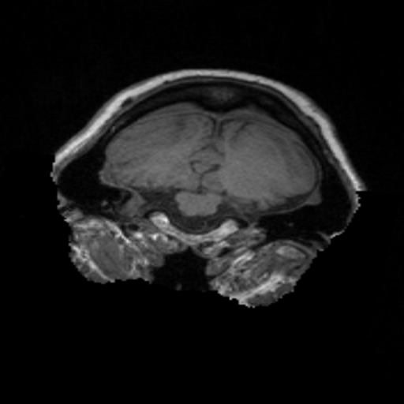</td>
<td>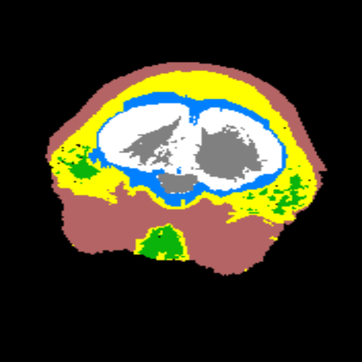</td>
<td>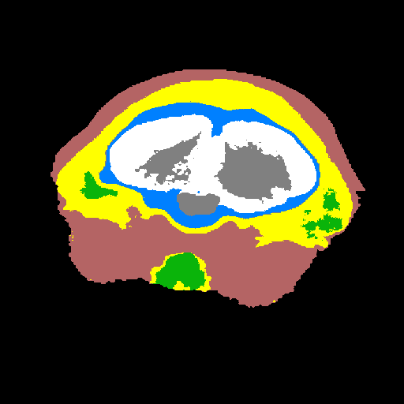</td>
</tr>
</table>

 
<h3>
References
</h3>
<b>1. Full-Head Segmentation of MRI with Abnormal Brain Anatomy: Model and Data Release</b> 
Andrew M Birnbauma, Adam Buchwald, Peter Turkeltaub, Adam Jacks, George Carr, Shreya Kannan,  
Yu Huang, Abhisheck Datta, Lucas C Parra, Lukas A Hirsch 
<a href="https://arxiv.org/pdf/2501.18716">https://arxiv.org/pdf/2501.18716</a>
  
<b>2. TensorFlow-FlexUNet-Image-Segmentation-Model</b> 
Toshiyuki Arai  
<a href="https://github.com/sarah-antillia/TensorFlow-FlexUNet-Image-Segmentation-Model">
https://github.com/sarah-antillia/TensorFlow-FlexUNet-Image-Segmentation-Model
</a>
 
 

